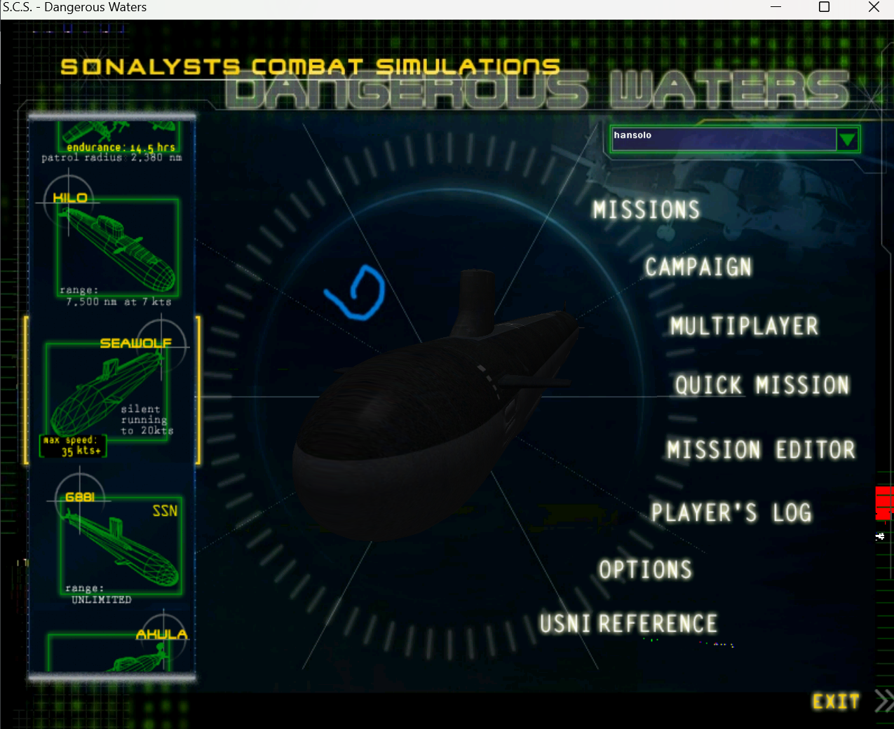
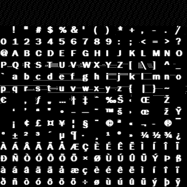
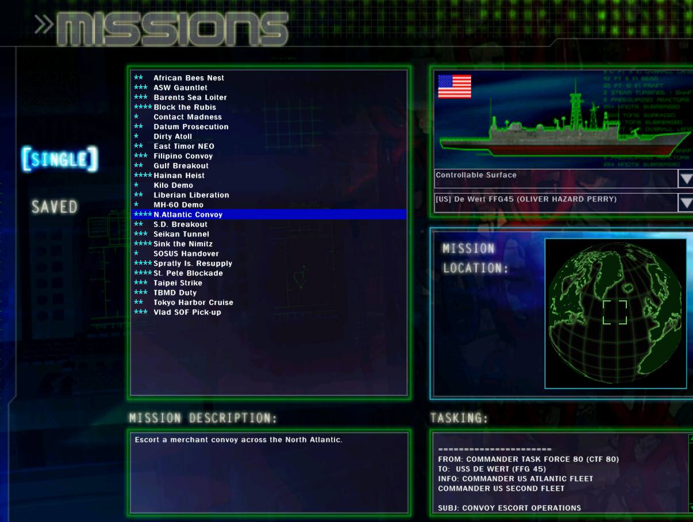

# dangerous_waters_chinese_translation  
dangerous_waters是个老游戏，但是非常优秀
尝试对dangerous_waters进行汉化   
(grp工具来自论坛 https://www.adammil.net/blog/v108_Reverse_Engineering_Dangerous_Waters.html)
## 1. 首先对资源文件解包
## 2. 发现UI可以直接修改bmp图片文件，再打包回去即可:
  随便修改在背景上划一条线测试：
  
## 3. 英文文本估计是调用通过压缩在 shared/fru_bold_r1.bmp 英文字库实现：
  
    
## ?? 但是怎么汉化为中文未知

## 解包工具:
  ./scripts/unpack_dw_files.py   
  ./scripts/test_scale_image.py  修改保持图片大小 瞎写的
## 4.如何重新打包?
### 4.1 以./Graphics/mainmenu.ndx(grp) 为例子:  
  ./scripts/repack_dw_files.py  
  或者
  先解除原本的连接，重新打包 grp_rebuild.exe -unlink *.bmp -repack  
  再添加修改后的资源，重新打包 grp_rebuild.exe -add *bmp -repack   
  再把修改后的 mainmenu.ndx(grp) 覆盖游戏路径下 ./Graphics/mainmenu.ndx(grp)即可 
  资源文件不一定都是bmp格式，目前发现修改后的文件必须和源文件保持相同的大小，否则打包报错